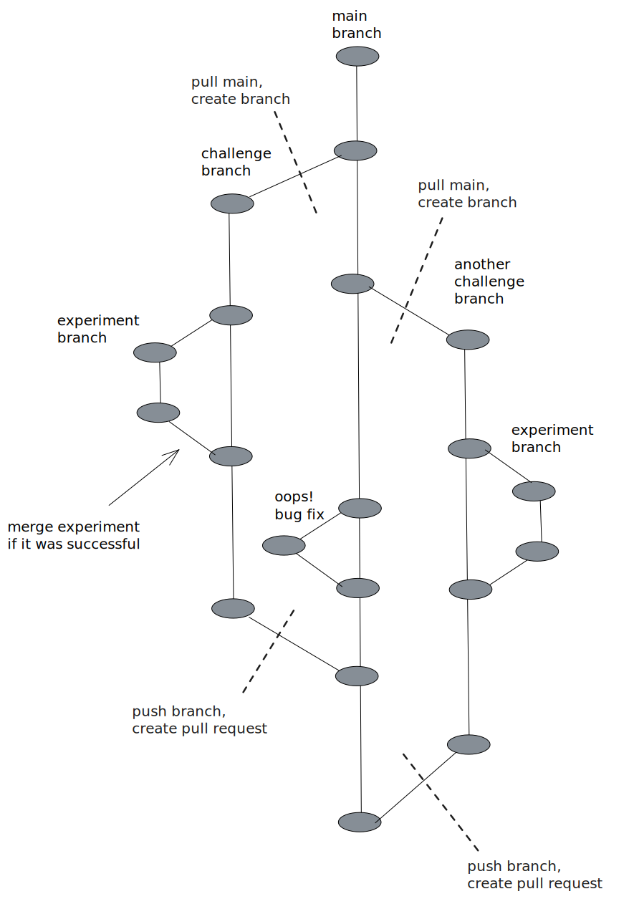

# Development

Everything is planned, the board is ready, it's time to get working. As you
develop your project, you will keep track of everything on the project board.

## `/notes`

This repository comes with an empty [/notes](./notes) folder your group can use
to keep shared notes on everything you learn about Python, Git, GitHub, code
review, collaboration ... or life : )

## `help-wanted` Label

Add this label to your issue when you're blocked. Your team mates will be able
to see this on the project board or by filtering all the project issues.

## Opening New Issues

Issues are flexible, you can always create new issues or update existing ones
after the project has started. Up to now you have created issues for planned
tasks, but issues can be used for all sorts of tasks. Especially tasks that you
weren't able to plan for.

Some common reasons to create new issues:

- **Bugs**: if you find a _bug_ in the `master`/`main` branch you can open a new
  issue, describe the problem, and attach the `bug` label. Someone can claim the
  issue, fix the bug on a new branch, and open a PR.
- **Enhancements**: if you have an idea to improve code that _already exists_ in
  the `main` branch you can open a new issue, describe the changes you have in
  mind, and add the `enhancement` label. If some has time they can claim this
  issue, develop the enhancement on a new branch, and send a PR.

## Claim, Branch, Review, Merge

This is it, the real deal. Finally you can write some code!

You and your team mates will each work on one task at a time, asking for help
and tracking your progress with the project board.

You will be responsible for writing your code on a new branch, and your team
mates will be responsible for reviewing and merging your code to main/master. As
a team you should make your best effort to use _branches_ for organizing your
work. If you wrote a good development strategy you will already be half-way
there.

It will take a little while to get used to this workflow, but once you do
there's no going back:

### Branching Strategy

Your group's git branches should look something like this:

## Individual Workflow

Your individual workflow should look something like this:

